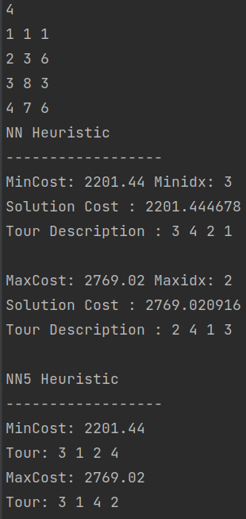

# Travelling Salesman Problem Solver
Finds solution to the Travelling Salesman Problem given latitude and longitude of the cities(nodes)
## Nearest Neighbour Algorithm
The nearest neighbour algorithm was one of the first algorithms used to solve the travelling salesman problem approximately. 
In that problem, the salesman starts at a random city and repeatedly visits the nearest city until all have been visited. 
The algorithm quickly yields a short tour, but usually not the optimal one.
## Input
* Number of nodes
* Node_No Latitude Longitude
## Output

